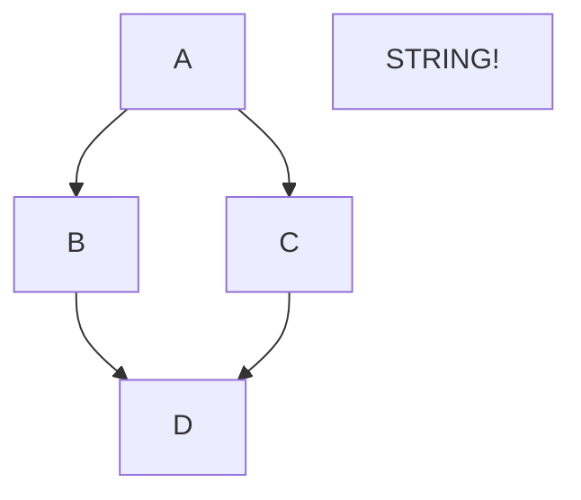

# https://docs.github.com/en/get-started/writing-on-github


## [md table](https://docs.github.com/en/get-started/writing-on-github/working-with-advanced-formatting/organizing-information-with-tables)

| First Header  | Second Header |
| ------------- | ------------- |
| Content Cell  | Content Cell  |
| Content Cell  | Content Cell  |


- Hyphens are used to create each column's header, while pipes separate each column
- include a blank line before your table in order for it to correctly render (???) 
- pipes on either end of the table are optional
- must be at least three hyphens in each column of the header row


Command | Description
--- | ---
git status | List all new or modified files
git diff | Show file differences that haven't been staged


## `mermaid` [flow chart](https://docs.github.com/en/get-started/writing-on-github/working-with-advanced-formatting/creating-diagrams):

```
   A-->B;
    A-->C;
    B-->D;
    C-->D;
```




## [render STLs](https://docs.github.com/en/repositories/working-with-files/using-files/working-with-non-code-files#3d-file-viewer)


```stl
solid cube_corner
  facet normal 0.0 -1.0 0.0
    outer loop
      vertex 0.0 0.0 0.0
      vertex 1.0 0.0 0.0
      vertex 0.0 0.0 1.0
    endloop
  endfacet
  facet normal 0.0 0.0 -1.0
    outer loop
      vertex 0.0 0.0 0.0
      vertex 0.0 1.0 0.0
      vertex 1.0 0.0 0.0
    endloop
  endfacet
  facet normal -1.0 0.0 0.0
    outer loop
      vertex 0.0 0.0 0.0
      vertex 0.0 0.0 1.0
      vertex 0.0 1.0 0.0
    endloop
  endfacet
  facet normal 0.577 0.577 0.577
    outer loop
      vertex 1.0 0.0 0.0
      vertex 0.0 1.0 0.0
      vertex 0.0 0.0 1.0
    endloop
  endfacet
endsolid
```
